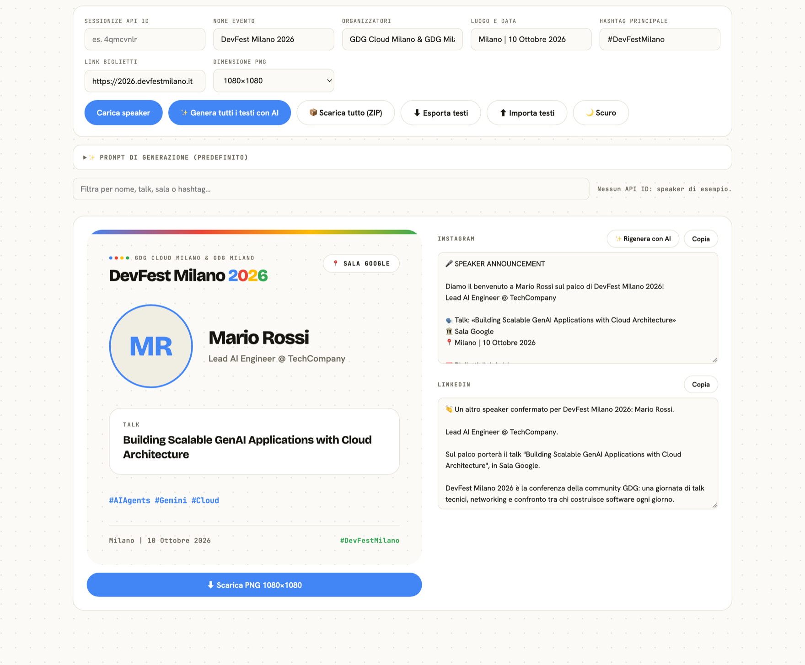

# DevFest posts generator

Prende gli speaker confermati da Sessionize e per ognuno genera la locandina
(PNG quadrato) piu' il testo del post per Instagram e LinkedIn, con o senza AI.



## Avvio

```bash
docker compose up --build   # http://localhost:8090
```

Sviluppo con hot reload, un comando solo:

```bash
npm run dev      # http://localhost:5173
```

Avvia Vite (hot reload della UI, React Fast Refresh) e il server Node in
`--watch` sulla 8091, che si riavvia da solo quando salvi `server.mjs`. Vite gli
gira `/api`, `/img`, `/genera` e `/stato`. Con `PORT=...` cambi la porta del
backend; la 8080 di default in Docker in locale e' spesso gia' occupata.

**Docker non ha hot reload**: serve la build di `dist/`, quindi ogni modifica
richiede `docker compose up --build`. Usalo per provare il risultato finale,
non per sviluppare.

## Uso

1. Incolla l'**API ID** di Sessionize, compila i campi dell'evento, premi
   **Carica speaker**. Resta nel localStorage. In alternativa apri
   `http://localhost:8090/?api=<API_ID>`.
2. **Dimensione** sceglie il lato del PNG (1080, 1350, 1620, 2160). Vale sia per
   il download singolo sia per lo ZIP, e finisce nel nome del file.
3. **📦 Scarica tutto (ZIP)**: tutte le locandine visibili piu' `testi-post.doc`
   con i testi di ogni speaker, Instagram e LinkedIn.
4. **⬇︎ Esporta testi** salva un JSON con configurazione, testi dei due post e
   modifiche fatte a mano sulle locandine. **⬆︎ Importa testi** lo ricarica: utile
   per riprendere il lavoro, passarlo a qualcuno o rivedere i testi altrove.
   L'abbinamento usa l'id Sessionize e, se non combacia, il nome dello speaker.
5. **🌙 Scuro / ☀️ Chiaro** cambia tema; la versione scura esce col suffisso `-dark`.
6. **✨ Rigenera con AI** riscrive i due post per uno speaker, **✨ Genera tutti**
   li rifa per tutti (tre alla volta). Serve la configurazione qui sotto.
7. Senza API ID vedi uno speaker di esempio, utile per provare il layout.

Ogni campo della locandina e' **modificabile cliccandoci sopra**. I segnaposto
dei campi vuoti non finiscono nel PNG.

## Cosa arriva dai dati e cosa no

| Campo locandina | Origine |
|---|---|
| Nome, ruolo, foto | speaker Sessionize (tagline tagliata al primo `\|`) |
| Titolo | sessione confermata |
| Talk o Workshop | dedotto da sala e durata: Sessionize non lo marca |
| Sala | `rooms[]` + `session.roomId`, cioe' la schedule pubblicata |
| Hashtag argomento | dedotti da titolo + abstract (`TOPIC_TAGS` in `src/sessionize.js`) |

Vengono restituiti solo gli speaker pubblicati, e l'app scarta le sessioni con
`isConfirmed: false`: in lista restano solo i confermati.

## AI

Facoltativa. Senza configurazione i post escono da template e i pulsanti AI
spariscono. Copia `.env.example` in `.env` e riempi:

```
AI_ENDPOINT=...   # Gemini o Azure AI Foundry, vedi .env.example
AI_API_KEY=...
AI_MODEL=...
```

Vanno bene anche i nomi `AZURE_AI_FOUNDRY_*`. L'endpoint puo' essere l'URL
completo di `chat/completions` o solo quello base della risorsa Azure.

La chiave sta **solo sul server**: il browser chiama `/genera`, mai il provider.
Al modello passano nome e cognome, ruolo, bio, tipo di sessione, titolo,
abstract completo, sala e argomenti — non solo il titolo.

Il **prompt e' modificabile dall'interfaccia** (pannello "Prompt di generazione"),
resta nel localStorage e si ripristina con un pulsante.

## Struttura

- `src/` — UI React (Vite). `sessionize.js` mapping dei dati, `posts.js` template
  e chiamata a `/genera`, `export.js` PNG/ZIP/Word, `Card.jsx` la locandina.
- `server.mjs` — un solo processo Node senza dipendenze: serve `dist/`, fa da
  proxy verso Sessionize e parla col provider AI.
- `test.mjs` — `npm test`, copre il mapping del payload Sessionize.

Il proxy non e' decorativo: le foto devono arrivare same-origin, altrimenti
html2canvas sporca il canvas e l'export PNG fallisce.

## Tema

Ripreso da <https://2026.devfestmilano.it>: token chiari e scuri (`#fbfaf6`/`#0f0e0c`
fondo, `#17150f`/`#f4f1e9` testo, i quattro colori GDG), sfondo a puntini,
micro-label in mono, chip col bordo sottile. Font Bricolage Grotesque, Hanken
Grotesk e JetBrains Mono.

Nota: il pattern a puntini e' un SVG inline e non un `radial-gradient` perche'
html2canvas i gradient radiali non li disegna, e sparirebbe dal PNG.
